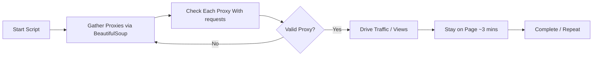

# Auto Proxy Traffic Booster (APTB) 🚀

<p align="center">
  <em>An open-source Unlimited Website Traffic Generator and YouTube View Generator.</em><br>
  <strong>For educational and fun purposes only!</strong>
</p>

---

## ✨ Modded by: **prestonzen**  
- **Website**: [PrestonZen.com](https://prestonzen.com)  
- **Instagram**: [@prestonzen](https://www.instagram.com/prestonzen)  
- **GitHub**: [prestonzen](https://www.github.com/prestonzen)  
- **Dedicated to**: The Cyber Community  

**For custom apps:**  
> If you want to hire a US-based agency to build apps for you, check out [KaizenApps.com](https://kaizenapps.com).  

---

## ⚠️ Blackhat SEO Disclaimer

> **Heads-Up**: This script can be misused for artificially inflating traffic or manipulating SEO metrics, sometimes called “blackhat SEO.” We **strongly** discourage such usage. **Use it responsibly** and **only for learning/fun**! We’re not liable if you push this into unethical or illegal territory.

---

## 📝 Note

- You **must** have an active internet connection for the script to work.
- **Geckodriver** is mandatory. If it’s missing, the script will automatically direct you to install it.
- **Potential uses**:
  - **CPV/CPM Ads** (if the target site doesn’t detect bots).
  - **YouTube Views** (if YouTube doesn’t detect bots).
- This script is intended **only for educational and fun experiments**.
- **No warranties.** The developer isn’t responsible for any misuse.

---

## 🌟 Features

- **Cross-Platform**: Works on Windows & Linux.
- **Auto Geckodriver check**: If missing, opens the download page.
- **Flexible Timeouts**: Defaults to 3-minute page load + 3-minute “stay” time (customizable).
- **Selenium + BeautifulSoup** synergy.
- **Proxy-Fest**: Taps into massive free proxy lists.
- **Lightweight**: Runs one session at a time to minimize crashes.
- **Super Simple**: Just run and follow prompts.

---

## 🛠 Installation

### 1. Clone & Navigate

```bash
git clone https://github.com/prestonzen/autoProxyTrafficBooster.git
cd autoProxyTrafficBooster
```

### 2. Install Dependencies

Install:

```bash
pip install -r requirements.txt
```

### 3. Install Geckodriver

#### For 32-bit or 64-bit Linux:
1. [Download Geckodriver](https://github.com/mozilla/geckodriver/releases).
2. Open a terminal where you downloaded Geckodriver.
3. Run:
   ```bash
   tar -xvzf geckodriver*
   chmod +x geckodriver
   sudo mv -v geckodriver /usr/local/bin/
   ```
   (Adjust with or without `sudo` depending on your system.)

#### For Windows:
1. [Download Geckodriver](https://github.com/mozilla/geckodriver/releases).
2. Extract the `.zip`.
3. Add the folder with `geckodriver.exe` to **System PATH**.

---

## ⚙️ Usage

1. **Run** the script:
   ```bash
   python aptb.py
   ```
2. **Enter Target URL** when prompted (defaults to `https://10anime.com` or any you choose).
3. **Set Timeout & Stay Times** as desired, or press Enter for the defaults (3 minutes each).
4. **Watch** as the script fetches proxies, tests them, and then drives traffic via Selenium.

---

## 🔁 Process Flow



---

## 🤝 Contributing

- Issues, pull requests, and suggestions are always welcome!
- This is a fun, educational project—be creative!

---

## 📞 Contact

- **Website**: [PrestonZen.com](https://prestonzen.com)  
- **Instagram**: [@prestonzen](https://www.instagram.com/prestonzen)  
- **GitHub**: [prestonzen](https://github.com/prestonzen)  

**Or** hire a professional US-based team at [KaizenApps.com](https://kaizenapps.com).

---

## 🎉 Final Words

> **Did it for fun!** Use at your own risk. Don’t rely on this for any serious commercial or deceptive “blackhat” SEO. It can be interesting to see how proxies & Selenium automation work, but websites **will** detect advanced bot traffic.  

> **This project is provided “as-is”** for **educational** and **entertainment** purposes.  
> **We disclaim all responsibility** if you use it for unethical or unlawful activities.  

Have fun, and learn a lot! ✨  